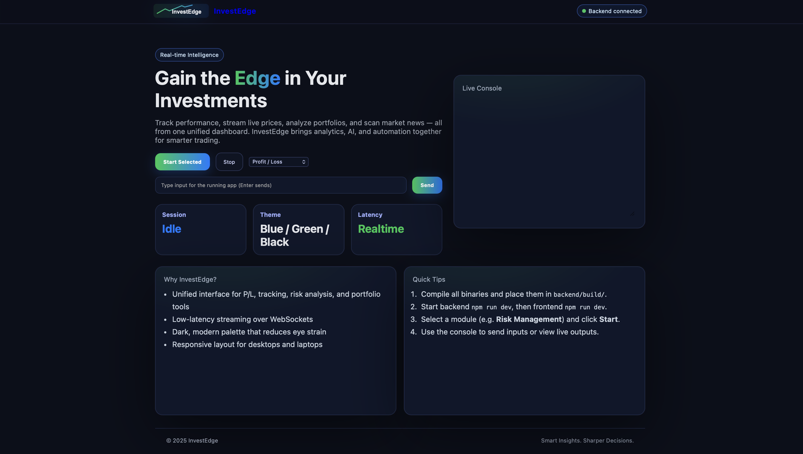
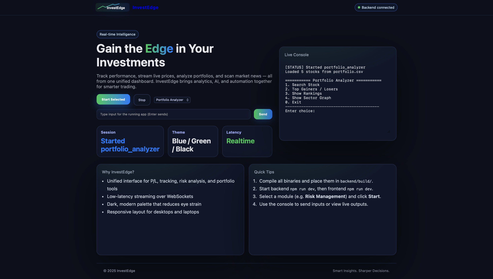
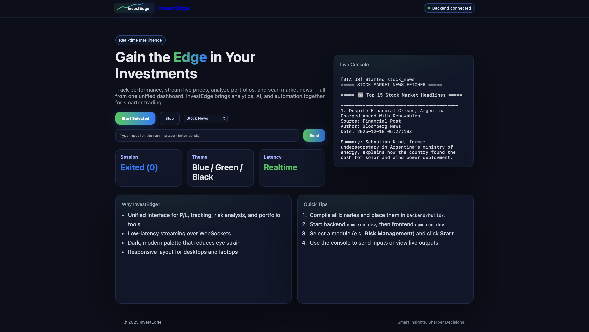
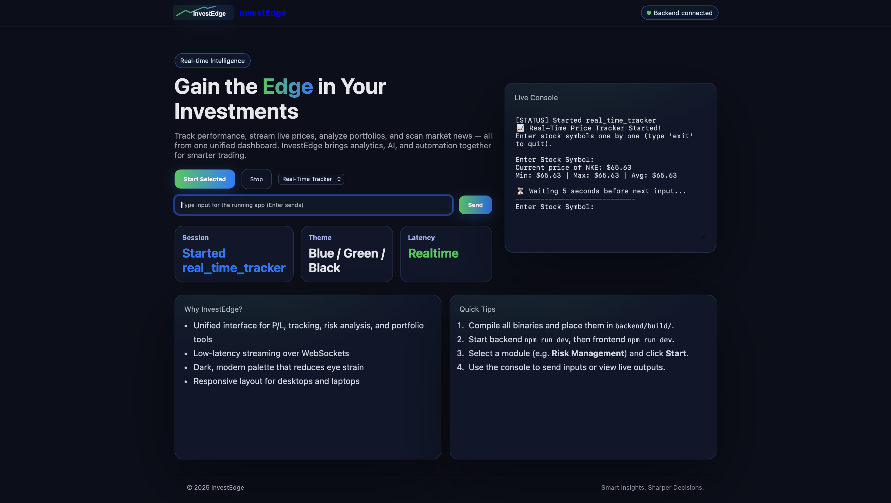

# InvestEdge

An academic prototype with five interactive C++ command-line tools, a local Node.js/Socket.IO server, and a React interface that streams terminal output.

| Program | Current behavior |
| --- | --- |
| `profit_loss` | Records buys and sells, supports undo/redo, saves CSV history, and compares total buy/sell cash flows. This is not a realized/unrealized cost-basis calculation. |
| `portfolio_analyzer` | Reads sample stock data from CSV, ranks movers and market capitalization, and displays stock/sector information. |
| `real_time_tracker` | Polls Twelve Data for prices using a supplied API key. |
| `risk_management` | Monitors prices against user-entered stop-loss and target thresholds. |
| `stock_news` | Fetches NewsAPI articles using a supplied API key. |

The current UI displays text output. Accounts, charts, AI models, and production deployment are not implemented. This prototype is for coursework and experimentation.

## Run locally

Requires Node.js 22.12+, a C++17 compiler, CMake 3.20+, and libcurl development headers. CMake downloads the pinned nlohmann/json dependency. On Ubuntu, install `libcurl4-openssl-dev`.

```sh
cd backend
npm ci
cmake -S . -B build
cmake --build build
npm test
# Only needed for the news/price programs:
export NEWS_API_KEY="your-newsapi-key"
export TWELVE_DATA_API_KEY="your-twelve-data-key"
npm run dev
```

In a second terminal:

```sh
cd frontend
npm ci
npm run dev
```

Open `http://localhost:5173`. Select a program, start it, and send each requested input through the text box. Stop a running program before choosing another.

The server binds to `127.0.0.1:5055`, accepts exactly the five program names above, and resolves their executables only from `backend/build`. Browser access defaults to `http://localhost:5173` and `http://127.0.0.1:5173`; set `ALLOWED_ORIGINS` to exact comma-separated origins for another local frontend port. It has no account authentication and should remain local. Program data files are shared within the backend directory.

CI runs Socket.IO security tests, builds the C++ tools, and builds the frontend. Market API calls require credentials and are not part of CI.

## Screenshots






## License

MIT. Author: Dhruv Sharma.
